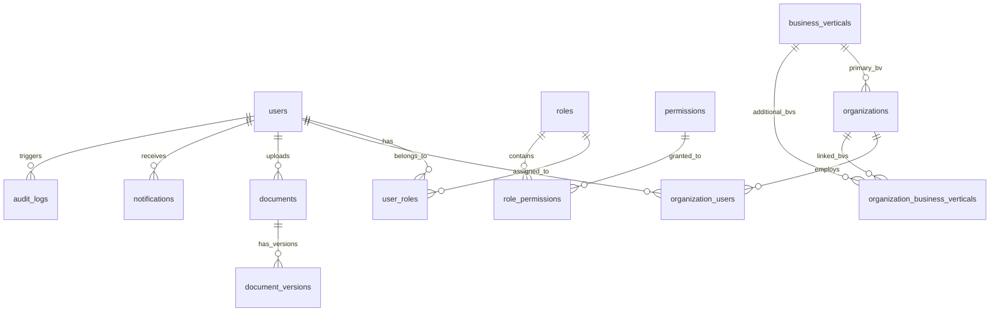

# AnveshakHub Enterprise Database ERD & Entity Specification

## Entity-Relationship Blueprint (Foundation Layer)



## Core Entity Dictionary

| Entity | Canonical Prefix / Primary Key | Key Attributes | Required Relationships |
| :--- | :--- | :--- | :--- |
| **users** | `UUID` | `email`, `password_hash`, `status` | `user_roles`, `org_users` |
| **roles** | `UUID` | `code`, `name`, `description` | `role_permissions`, `user_roles` |
| **permissions** | `UUID` | `code`, `resource`, `action` | `role_permissions` |
| **organizations** | `org_number` (`ORG-000001`) | `legal_name`, `type`, `website` | `primary_bv`, `organization_bvs` |
| **business_verticals** | `code` (`BV-01`..`BV-06`) | `name`, `sort_order`, `active` | `organizations` |
| **documents** | `UUID` | `entity_type`, `entity_id`, `storage_key` | `document_versions`, `uploaded_by` |
| **audit_logs** | `UUID` | `actor_user_id`, `action`, `before_json` | `users` |
```
